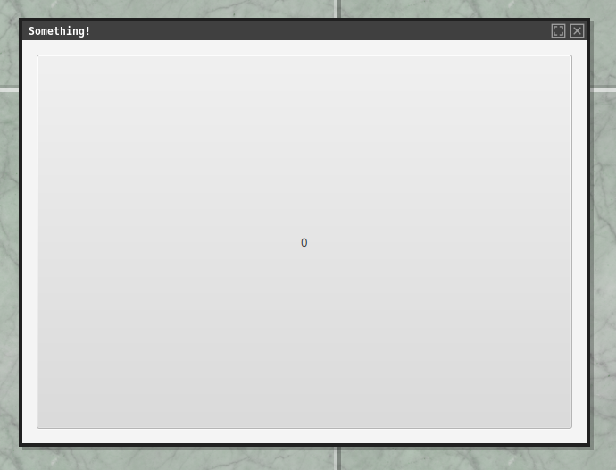

jfxboot
=

JavaFX in 30 seconds!



### Main

The [Main](com.io7m.jfxboot.app/src/main/java/com/io7m/jfxboot/app/Main.java) class is the main
command-line entry point. The code calls `Platform.startup()` which tells
JavaFX to initialize the platform and execute the given `Runnable` on the
JavaFX main thread. JavaFX is (effectively) single-threaded in the same manner
as Swing.

The `Runnable` passed to `Platform.startup()` creates a new window (a `Stage`
in JavaFX terminology), instantiates our [MainApplication](#mainapplication)
class, and then tells `MainApplication` to populate the window we created
with a _Scene_.

### MainApplication

The [MainApplication](com.io7m.jfxboot.app/src/main/java/com/io7m/jfxboot/app/internal/MainApplication.java) class
is responsible for instantiating a _scene_. A _scene_ is essentially a container
for a set of UI components, and there's normally one scene per application
window. It's possible to build a scene by hand, but more typical is to
use an _FXML_ file to define a scene. The included [main.fxml](com.io7m.jfxboot.app/src/main/resources/com/io7m/jfxboot/app/internal/main.fxml)
file was created using
[SceneBuilder](https://gluonhq.com/products/scene-builder/), but we could
of course write it by hand too if masochism was our thing.

We call `FXMLLoader.load()`, and this causes JavaFX to reflectively look up
the _controller_ class declared in the FXML file. A controller class implements
the business logic for a UI, and holds references to UI elements that are
automatically injected into the class instance using `@FXML` annotations.

In this case, the controller class we created is [MainController](com.io7m.jfxboot.app/src/main/java/com/io7m/jfxboot/app/internal/MainController.java).
The `MainController` class in our case _must_ have a public no-arg constructor
for JavaFX to be able to instantiate it. In real applications, we'd probably
want to be able to pass values to the contructor and so we'd give `FXMLLoader`
a _controller factory_ that we could use to call whatever constructors we
wanted.

### MainController

The `MainController` class implements `Initializable`, which declares a single
`initialize` method that will be called by JavaFX when the UI associated with
the controller has been fully initialized. The `MainController` class declares
a private `@FXML`-annotated `button` field that will contain a reference to
the button declared in the FXML layout we defined (it's not safe to access the
`button` field until `initialize` has been called). The class also defines
an `@FXML`-annotated method called `onButtonPressed` that we've declared should
be called whenever the user clicks the button in the FXML file.

### JPMS

We've defined a module descriptor that looks like this:

```
module com.io7m.jfxboot.app
{
  requires javafx.base;
  requires javafx.controls;
  requires javafx.fxml;
  requires javafx.graphics;

  opens com.io7m.jfxboot.app.internal to javafx.fxml;

  exports com.io7m.jfxboot.app;
}
```

It's obviously necessary to `require` the various JavaFX modules in order to
use them. We export the `com.io7m.jfxboot.app` package as that's the public
entry point into the application. We _don't_ export the
`com.io7m.jfxboot.app.internal` as that contains our private implementation
code. We do, however, have to `open` the `com.io7m.jfxboot.app.internal`
package for reflective access to the `javafx.fxml` module, because the
`FXMLLoader.load()` method used in the [MainApplication](#mainapplication)
class has to be able to reflectively instantiate the [MainController](#maincontroller) 
class.

Fun fact: Using JavaFX in non-JPMS applications is _kind of_ unsupported. If
you remove the `module-info.java` file we created and start the application,
it will work, but it will print this on stderr on startup:

```
May 05, 2022 5:38:54 PM com.sun.javafx.application.PlatformImpl startup
WARNING: Unsupported JavaFX configuration: classes were loaded from 'unnamed module @30dae81'
```

Most IDEs will not put modules on the module path if the target application
does not have a module descriptor, and that seems to be what happens here.
